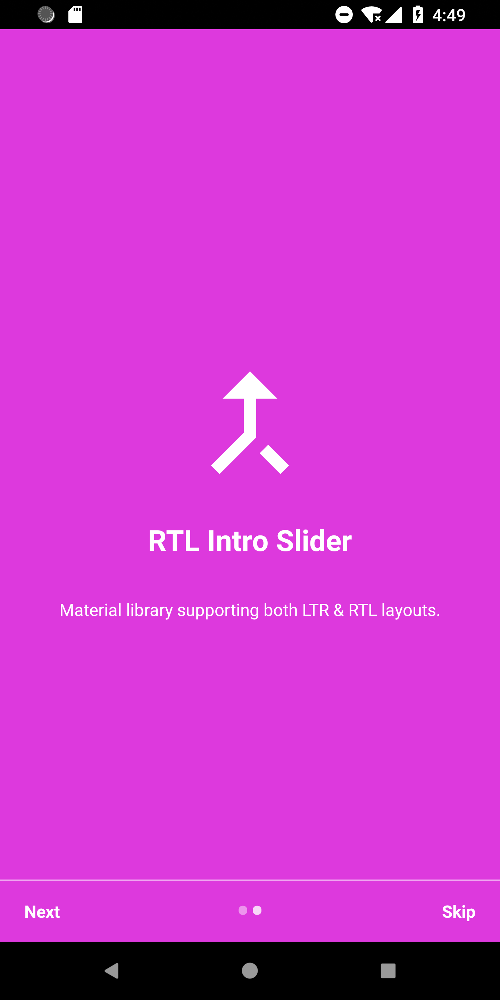
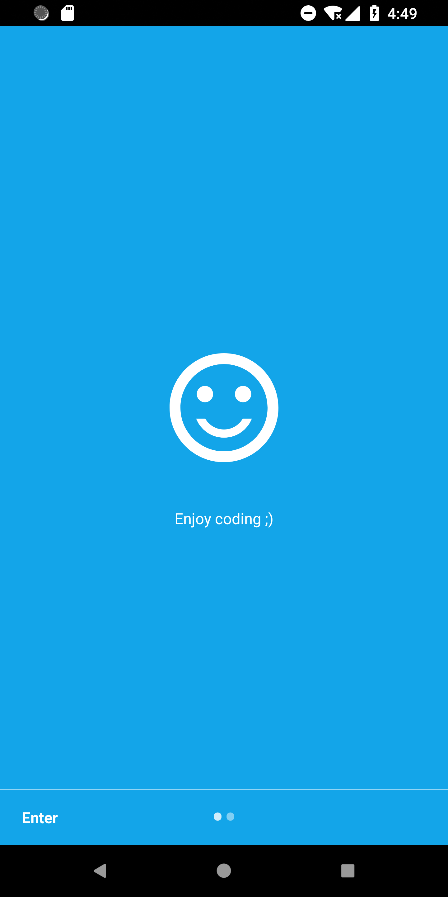

[](https://jitpack.io/#alikhaleghi76/rtl-slider)

# Android RTL intro slider


This is an android intro slider library with supporting RTL layouts. 


<p align="center">
  
  
</p>

## Import

First add jitpack maven repository to your project-level gradle file: 

```gradle
	allprojects {
		repositories {
			...
			maven { url 'https://jitpack.io' }
		}
	}
```

Then include library by adding it into your app-level gradle dependencies

```gradle
	dependencies {
	        implementation 'com.github.alikhaleghi76:rtl-slider:1.0.6'
	}
```

## Simple usage

After importing library, you can add slider to your layout xml file like this: 


```xml
    <ali.khaleghi.rtlintroslider.RTLIntroSlider
        android:layout_width="match_parent"
        android:layout_height="match_parent"
        android:id="@+id/introSlider" />
```

and in your java code: 

```java
        RTLIntroSlider introSlider = findViewById(R.id.introSlider);
        
        introSlider.addPage(
                "TITLE1",
                "DETAIL1",
                ContextCompat.getColor(this, R.color.intro_text_color1),
                ContextCompat.getColor(this, R.color.intro_background_color1),
                R.drawable.icon1
        );
        
        introSlider.addPage(
                "",
                "DETAIL2",
                ContextCompat.getColor(this, R.color.intro_text_color2),
                ContextCompat.getColor(this, R.color.intro_background_color2),
                -1
        );
        
```

## Advanced usage

You can customize almost everything in this library!
To customize slider through xml, first add this line of code to your root layout: 


```xml
    xmlns:sliderOptions="http://schemas.android.com/apk/res-auto"
```
Then you can use this attributes to customize slider: 

```xml
    <ali.khaleghi.rtlintroslider.RTLIntroSlider
        android:layout_width="match_parent"
        android:layout_height="match_parent"
        android:id="@+id/introSlider"
        sliderOptions:next_text="@string/next"
        sliderOptions:skip_text="@string/skip"
        sliderOptions:enter_text="@string/enter"
        sliderOptions:show_indicator="true"
        sliderOptions:is_rtl="true"
        sliderOptions:active_dot_color="#CCFFFFFF"
        sliderOptions:inactive_dot_color="#77FFFFFF"
        sliderOptions:separator_color="#88FFFFFF"
        sliderOptions:next_color="#FFFFFF"
        sliderOptions:skip_color="#FFFFFF" />
```

You can customize slider inside java code like this: 

```java
        
        // to set custom font
        introSlider.setTypeface(Typeface.createFromAsset(context.getAssets(), "fonts/custom_font.ttf"));

        // show/hide skip button
        introSlider.setSkipVisibile(true);

        // rtl/ltr slider
        introSlider.setRtl(true);

        // text of next button
        introSlider.setNextText("NEXT");

        // text of skip button
        introSlider.setSkipText("SKIP");
        
        // to add custom slider page
        introSlider.addFragment(new Fragment1());

        // show/hide indicator
        introSlider.setShowIndicator(true);
        
        // to add list of custom pages
        ArrayList<Fragment> fragments = new ArrayList<>(); 
        fragments.add(new Fragment1()); 
        fragments.add(new Fragment2()); 
        introSlider.addFragments(fragments);
        
        // observe skip button click
        introSlider.addOnSkipClickListener(() -> finish());
        
```

## License
[GNU General Public License v3.0](https://github.com/alikhaleghi76/rtl-slider/blob/master/LICENSE)
